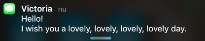

## Voice, SMS & MMS for developers.

Welcome to our developer friendly API service! :-)

We make it easy for you to add custom telephony features that are perfectly suited to the way you do things – because sometimes ‘off the shelf’ just doesn't cut it.

You can use [46elks](https://www.46elks.com) for:

* Sending SMS text messages
* Receiving SMS to your applications
* Sending & receiving MMS pictures
* Controlling incoming and outgoing telephone calls with code
* Building interactive voice sessions
* And other telephony [features](https://www.46elks.com/features).


### Links

  * [Quickstart](#quickstart)
  * [API documentation](https://www.46elks.com/api-docs#introduction)
  * [Code examples](#code-examples)
  * [Login / sign up](https://dashboard.46elks.com/)
  * [Introduction to using an API](https://zapier.com/learn/apis/)
  * [Contact the elks](https://www.46elks.com/help#contact)

## Quickstart

1. Create your [46elks account](https://www.46elks.com/create-account) and locate your [api keys](https://dashboard.46elks.com/).
2. Send your first SMS from the [dashboard](https://dashboard.46elks.com/) or with curl (see below).
3. Send an SMS code using one of our [code examples](code-examples).
4. Learn more about what you can do by reading the [documentation](https://46elks.com/docs).


## Send your first SMS with curl

Use your [api keys](https://dashboard.46elks.com) and run this in your terminal:

```
curl https://api.46elks.com/a1/sms \
  -u <api_username>:<api_password> \
  -d from=CurlyElk \
  -d to=+46766861004 \
  -d message="Test message to your phone."
```




<br>

## Code examples

All code examples are public domain and can be used freely.

[C](code-examples/c) -
[C# | .NET](code-examples/c-sharp) -
[Elixir](code-examples/Elixir) -
[Go](code-examples/Go) -
[Google apps](code-examples/Google%20apps%20script) -
[haskell](code-examples/Haskell) -
[HTML](code-examples/HTML) -
[PHP](code-examples/PHP) -
[Python](code-examples/Python) -
[Ruby](code-examples/Ruby) -
[Java]( code-examples/Java) -
[Node.js](code-examples/Node) -
[cURL](code-examples/cURL)

##### Build an interactive voice menu or response (IVR)

[IVR samples collection](code-examples/Voice-IVR-interactive-voice-menues).

[Show all coding examples for all languages](code-examples)

<br>

## Community resources
*Projects*
* [Love messenger](https://github.com/gish/love-messenger) by Erik Hedberg
* [Answering machine - record incoming phone calls ](https://github.com/nicevo/46elks_recorder) by nicevo

*Modules, SDKs and libraries*
* [Ruby client](https://github.com/jage/elk) by Johan Eckerström
* [Wordpress module](https://github.com/tobiasehlert/WP-SMS-46elks) by Tobias Ehlert
* [Codeigniter extension](https://github.com/nyfagel/codeigniter-46elks) by Jan Lindblom

*Tutorials*
* [Receive SMS into Google spreadsheet](https://medium.com/@46elks/receive-sms-into-google-spreadsheet-435b51393493#.9ku01h462)


Have you written a tutorial or created an app that you're willing to share?
Let us know at hello@46elks.com!

## Demos
* [passer](https://github.com/46elks/passer) - Self-hosted "sms to twitter" written in Python
* [elkme](https://github.com/46elks/elkme) - Send SMS from the command line

## Resources
* [Postman app](https://www.getpostman.com/) - Interact with APIs through a Chrome app, also available as an OSX app.

## Integrations
  * [Zapier](https://zapier.com/zapbook/46elks/)
  * [Microsoft Excel](https://excel.46elks.com/)
  * Google spreadsheet [Google Script code sample](https://github.com/46elks/SMStoGoogleSheets) | Tutorial: [Receive sms into Google spreadsheet](https://medium.com/@46elks/receive-sms-into-google-spreadsheet-435b51393493#.iu690j86w)
  * [Hubot chat bot](https://github.com/github/hubot-scripts/blob/master/src/scripts/46elks.coffee)

<br>

# Teachers
Are you helping others learn how to code? Doing a workshop or a lesson on APIs?
Get in touch if you'd like to use the 46elks API to help more people learn about APIs.

Email: community@46elks.com  

<br>

# Hackathons
  We are keen on helping out, and we'd be happy to help you with preparations, mentoring and give away boosted credit packages for participants. [Talk to us](mailto:hello@46elks.com). We're also particularily interested in helping events and organizations working with teaching coding to beginners, initiatives that encourage diversity in IT, and among conferences. We enjoy meetups, let us know if you’d like for someone to come and hold a presentation about APIs - getting started with apis, how to send an sms in PHP/Python/Elixir/Ruby/Go or another language - we love to learn and share!  We exist to help you build useful and cool things!

**Contact 46elks**  
Email: hello@46elks.com  
Twitter: [@46elks](https://twitter.com/46elks)  
Instagram: [@46elks](https://www.instagram.com/46elks/)


